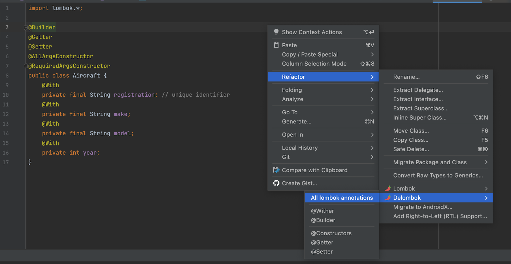

+++
weight=30
+++

{}

## Delombok 😿

---

### Delombok

We don't like external dependencies and you may feel trapped by using Lombok.

---

### Delombok

Fear not, you may very easily remove Lombok from your project and replace its annotations with vanilla Java code.


```java{|1-5,7,9,11,13}
@Builder
@Getter
@Setter
@AllArgsConstructor
@RequiredArgsConstructor
public class Aircraft {
    @With
    private final String registration; // unique identifier
    @With
    private final String make;
    @With
    private final String model;
    @With
    private int year;
}
```

---

### Delombok

Lombok IntelliJ plugin



---

### Without Lombok 🫤

```java{}
@public class Aircraft {
    private final String registration; // unique identifier
    private final String make;
    private final String model;
    private int year;

    public Aircraft(String registration, String make, String model) {
        this.registration = registration;
        this.make = make;
        this.model = model;
    }

    public Aircraft(String registration, String make, String model, int year) {
        this.registration = registration;
        this.make = make;
        this.model = model;
        this.year = year;
    }

    public static AircraftBuilder builder() {
        return new AircraftBuilder();
    }

    public String getRegistration() {
        return this.registration;
    }

    public String getMake() {
        return this.make;
    }

    public String getModel() {
        return this.model;
    }

    public int getYear() {
        return this.year;
    }

    public void setYear(int year) {
        this.year = year;
    }

    public Aircraft withRegistration(String registration) {
        return this.registration == registration ? this : new Aircraft(registration, this.make, this.model, this.year);
    }

    public Aircraft withMake(String make) {
        return this.make == make ? this : new Aircraft(this.registration, make, this.model, this.year);
    }

    public Aircraft withModel(String model) {
        return this.model == model ? this : new Aircraft(this.registration, this.make, model, this.year);
    }

    public Aircraft withYear(int year) {
        return this.year == year ? this : new Aircraft(this.registration, this.make, this.model, year);
    }

    public static class AircraftBuilder {
        private String registration;
        private String make;
        private String model;
        private int year;

        AircraftBuilder() {
        }

        public AircraftBuilder registration(String registration) {
            this.registration = registration;
            return this;
        }

        public AircraftBuilder make(String make) {
            this.make = make;
            return this;
        }

        public AircraftBuilder model(String model) {
            this.model = model;
            return this;
        }

        public AircraftBuilder year(int year) {
            this.year = year;
            return this;
        }

        public Aircraft build() {
            return new Aircraft(registration, make, model, year);
        }

        public String toString() {
            return "Aircraft.AircraftBuilder(registration=" + this.registration + ", make=" + this.make + ", model=" + this.model + ", year=" + this.year + ")";
        }
    }
}
```

{}